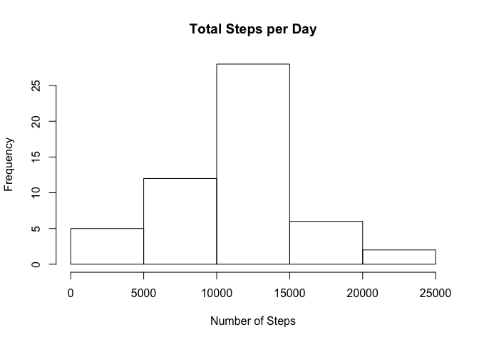
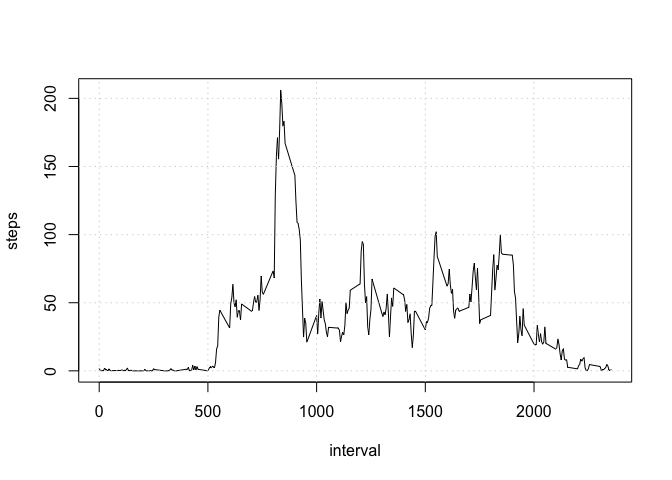

## Loading and preprocessing the data

```r
if (!file.exists('activity.csv')) {
  unzip(zipfile = "activity.zip")
}

activityData <- read.csv(file="activity.csv", header=TRUE)
```

## What is mean total number of steps taken per day?


```r
# Calculate the total steps taken per day
totalSteps <- aggregate(steps ~ date, activityData, FUN=sum)


# Make a histogram of the total number of steps taken per day
hist(totalSteps$steps,
     main = "Total Steps per Day",
     xlab = "Number of Steps")
```

<!-- -->


```r
# Calculate and report the mean and median of total steps taken per day
meanSteps <- mean(totalSteps$steps, na.rm = TRUE)
medSteps <- median(totalSteps$steps, na.rm = TRUE)
```


## What is the average daily activity pattern?

```r
# Make a time-series plot of the 5-minute interval and the average number of
# steps taken, averaged acoss all days.
library(ggplot2)
meanStepsByInt <- aggregate(steps ~ interval, activityData, mean)
plot(meanStepsByInt,type="l")
grid()
```

<!-- -->

```r
# Which 5-minute interval across all days contain the maximum number of steps
maxInt <- meanStepsByInt[which.max(meanStepsByInt$steps),]
```


## Imputing missing values


```r
# Missing values
missingVals <- sum(is.na(activityData))
print(missingVals)
```

```
## [1] 2304
```


## Are there differences in activity patterns between weekdays and weekends?
